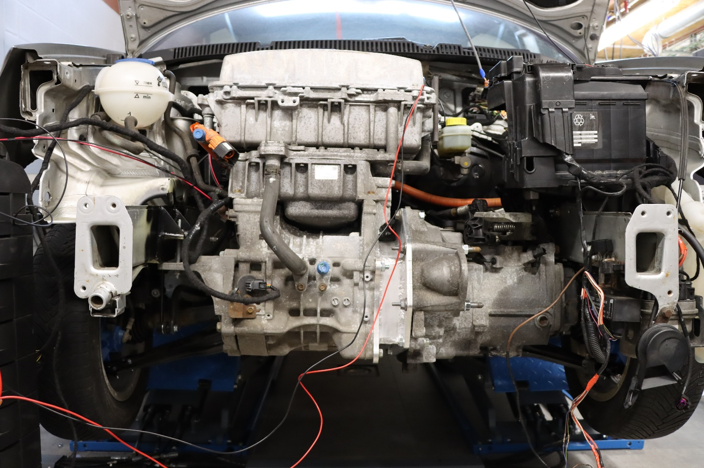

### Une polo rétrofittée pilotée par des raspberry pi et des arduinos

Dans l'univers des makers, il arrive régulièrement qu'on y croise des personnes aux idées qu'on pourrait parfois qualifier de farfelues... Loïc, Thibault et Marc entrent probablement dans cette catégorie de personnes qui décident de passer leur temps libre sur des projets inhabituels.

Ils se sont mis pour défi de prendre une Volkswagen Polo de 2007, d'y mettre un moteur électrique de Nissan Leaf de 2013 à l'intérieur, une batterie de Nissan nv200 et de modifier la polo pour la rendre prête à la conduite autonome en milieu contrôlé, rien que ça...

## Un projet issu d'une réflexion sur la durabilité des véhicules

Le rétrofit de véhicule (l'acte de convertir ce véhicule d'une motorisation thermique vers l'électrique), est présenté comme une des différentes solutions a la décarbonation du transport individuel. Cela permet de capitaliser sur l'empreinte carbonne existante du véhicule en partant de l'hypothèse que modifier un véhicule pour qu'il continue de rouler aura une empreinte carbone moins importante que de disposer du véhicule et en produire un nouveau.

Le terme "retrofit" est également utilisé dans d'autres contextes, notamment pour l'augmentation d'engins de chantier ou agricoles avec de nouvelles technologies, comme par exemple de la conduite autonome, avec ou sans électrification de la motorisation, ou encore dans l'amélioration ou la conversion de machines lourdes industrielles, fixes ou mobiles.

La question que Loïc, Thibault et Marc se sont posée est la suivante: "En pratique, quel est le coût et l'effort nécessaire pour le rétrofit d'un véhicule, que ce soit en terme de modifications mécaniques, logicielles et/ou technologiques au sens large, afin de l'amener au niveau des véhicules actuels ?". Avec une autre sous-question: "Est-ce que cela en vaut vraiment la peine ?".

La question de la viabilité économique du rétrofit d'un véhicule est un sujet d'actualité. Bien que populaire dans certains pays pour la conversion de voitures personelles qualifiées d'"ancêtres", la question reste ouverte pour les véhicules personels plus récents ou encore pour les véhicules plus lourds tels les camions, les engins de chantiers, les engins agricoles, et même (oui oui), les bateaux.

Que l'on "retrofite" l'un ou l'autre véhicule, la démarche reste la même, mais l'espace et l'outillage nécessaire peuvent changer... Pour notre petite équipe de makers, il était plus simple de travailler dans leur garage sur une citadine que sur un semi-remorque...

## Les choix techniques

Un des obstacles lorsque l'on change les composants d'une voiture et qu'on les remplace par des composants qui n'étaient pas prévus à l'origine, c'est de les faire parler ensemble... En effet, déjà en 2007, une quantité importante de fonctions de la voiture communiquaient ensemble sur un bus de communication présent également dans toutes les voitures actuelles, [le bus de données CAN](https://fr.wikipedia.org/wiki/Bus_de_donn%C3%A9es_CAN).

Il s'agit d'un bus de communication utilisé principalement dans l'automobile mais également dans la plupart des machines industrielles et dans l'aéronautique.

Prenons l'exemple qui nous occupe: placer un moteur électrique Nissan dans une Polo. Les messages que la Polo échange sur son bus de donnée sont différents de ceux attendus par le moteur Nissan et vice versa. Il est donc nécessaire de créer un système de "traduction" entre les deux permettant à ces composants de s'échanger de l'information. Tout composant ajouté à la voiture, et qui n'est pas supporté par celui-ci par défaut, doit passer par ce système de traduction.

C'est ce système de traduction qu'ils ont créé avec des raspberry pi et des arduinos ! Pour savoir quels messages supporter sur leur système, ils ont eu recours à la rétro ingénierie étant donné que la documentation de ces messages n'est pas généralement pas accessible au grand public !

Leur plateforme, OVCS (Open Vehicule Control System) est composée de plusieurs parties:
- Le VMS (Vehicle Management System) qui est le cerveau et s'occupe de la traduction et du routage des messages vers les bus de communications concernés. Tous les composants existants de la voiture y sont connectés, ainsi que les contrôlleurs et l'infotainment.
- Les contrôlleurs, qui permettent d'augmenter des fonctions analogiques et/ou digitales de la voiture et de les ajouter au bus de communication (par exemple permettre à la pédale d'accélération originelle et analogique de la Polo d'envoyer des messages sur le CAN ou pour activer les relais de charge et de pré-charge du moteur)
- L'infotainment, qui est un module optionel, et qui permet d'ajouter un écran tactile dans la voiture. Cet écran fourni des informations utiles au conducteur, et lui permettra de configurer des paramètres de la voiture ou de visualiser des informations de diagnostic par exemple.

Leur projet combine donc plusieurs bus de données, aggrégés par le VMS. Voici à quoi ressemble l'architecture de leur système:

Le VMS est constitué de:
- 3 raspberry PI 4 (pour assurer de la redondance dans le futur)
- Un "hub" SPI fait maison permettant d'y connecter jusqu'à 12 bus de données CAN grâce a des MCP2518fd
- Une alimentation faite maison pour le tout

Les contrôleurs sont constitués de:
- 1 arduino R4 Minima
- 1 module SPI CAN (mcp2515)

Les firmware des rasbpberry sont développés sur une plateforme appelée [Nerves](https://nerves-project.org/) qui permet l'utilisation d'un langage de haut niveau, basé sur Erlang et appelé [Elixir](https://elixir-lang.org/).

Elixir est un language particulièrement adapté à leur cas étant donné que celui-ci se base sur un concept de programmation appelé "pattern-matching", qui est idéal pour le traitement des messages envoyés en continu sur le bus de donnée CAN. Le code d'OVCS est disponible sur github: (lien).

Enfin pour gérer la charge et la décharge de la batterie, ils se sont rabattus sur un BMS (Battery Management System) [Orion](https://www.orionbms.com/) configurable.

## Les modifications mécaniques et de carrosserie

Au delà de la problématique de la communication entre des composants de différente marques, il reste la question de les "connecter" physiquement ensemble. En effet, un moteur de Nissan n'aura pas les mêmes fixations sur le chassis de la voiture que l'ancien moteur diesel de la Polo. Le nouveau moteur n'a pas la même empreinte que l'ancien et est donc physiquement incompatible avec la boîte de vitese de la polo. Il faut fabriquer des pièces sur mesure et pour cette combinaison précise.

Il a donc été nécessaire de souder de nouvelles fixations pour le moteur sur le chassis. Deux pièces de connextion ont dû être fabriquées sur mesure grâce à une découpeuse CNC et un tour a métaux pour connecter le moteur et la boîte de vitesse ensemble.

Pour la batterie, d'autres modifications et fabrications ont été nécessaires. Trois bacs en aluminium ont été fabriqués afin d'accueilllir les différentes cellules et des modifications de carrosserie ont été apportées à la voiture afin de placer les 3 bacs au mieux dans l'espace disponible:
- Le réceptacle de la roue de secours a été enlevé afin de placer 2 bacs de cellules juste en dessous de la voiture
- Le réservoir a été enlevé afin de permettre d'y insérer le troisième bac de cellules.

Au delà de ces changements nécessaires pour la modification, les trains avant et arrières ont été complètement rénovés et la voiture a été équipée de nouveaux freins a disque aux 4 roues ainsi que de nouvelles suspensions.

## Et... ça roule ?

La voiture n'est pas encore sortie du garage, mais les roues tournent ! La plateforme qu'ils ont développée permet de tester la communication entre tous les composants et de faire tourner les roues lorsqu'on appuie sur la pédale d'accélération.

<video width="320" height="240" controls>
  <source src="./ovcs_wheel.mp4" type="video/mp4">
</video>

<video width="320" height="240" controls>
  <source src="./ovcs_dashboard.mp4" type="video/mp4">
</video>

Plusieurs adaptations ont d'ailleurs été faites afin de rendre ce rétrofit le plus "naturel" possible:
- La clé de la polo enclenche les relais permettant au moteur de tourner
- L'indicateur de tours par minute sur le tableau de bord de la polo affiche bien les tours par minute du moteur électrique
- L'infotainment montre bien les différents status de plusieurs composants (frein a mein enclanché ou non, phares allumés ou non...)

La solution est pour le moment au stade de prototype fonctionnel et à l'heure de la rédaction de cet article, ils sont occupés à recabler la voiture et d'y connecter les batteries ainsi que tous les composants du système afin de pouvoir sortir la voiture du garage !

## Les étapes encore à finaliser

Il reste encore du chemin à parcourir avant d'en faire un véhicule qui pourrait servir à l'expérimentation de conduite autonome, et en particulier:
- Il faut changer la colonne de direction. En effet, celle d'origine ne permet pas la contrôller électroniquement.
- Il faut changer le système de freinage. Dans les anciennes voitures, les servo freins utilisent la dépression créée par le moteur pour activer un piston et fournir une assistance au freinage. Difficile à faire avec un moteur électrique...
- Améliorer leur logiciel et s'assurer qu'il y a suffisement de redondance.

Plusieurs phases de tests en milieu contrôllé suivront ensuite afin de tester la voiture en conduite manuelle et, peut-être un jour, autonome !

## Leurs conclusions à ce stade du projet

A la question du coût et de l'effort nécessaire, voici leur réponse:

> Le plus lourd dans un rétrofit est l'élaboration du kit de conversion en lui même. Ce kit sera compatible avec un nombre très limité de composants et de modèles de voitures. Si on compare avec toutes les combinaisons possibles de modèles, de moteurs électriques et de batteries, on se rend vite compte que la mise à l'échelle de ce genre de conversion n'est pas une mince affaire. Ecologiquement, la conversion d'un véhicule reste la meilleure manière de capitaliser sur son empreinte carbone existante, mais économiquement, à part dans certains cas précis et à petite échelle, il est difficile de se dire que cela vaut vraiment le coup. Pour les ancêtres c'est une autre histoire, il y a souvent un aspect emotionel qui transcende la question du prix de la conversion à proprement parler. Pour les véhicules plus grands ou plus onéreux, cela peut avoir plus de sens. Un semi remorque avec 25 tonnes de charge utile peut se permettre de transpoter 3 tonnes de batteries, sa charge utile sera encore de 22 tonnes. Mais au final, c'est le rapport coût bénéfice qui dirigera le choix de rétrofitter ou pas ses camions pour l'entreprise concernée.

> Une manière de réduire le prix de cette fabrication de kits serait d'avoir un accès plus facile aux spécifications des véhicules considérés en fin de vie par leur constructeurs (+ de 10 ans par exemple), ainsi qu'une documentation publique ou sur demande des messages permettant de faire fonctionner les composants utilisés (les fameux message CAN). Malheureusement, ce n'est pas vraiment dans l'intérêt des constructeurs de fournir ces informations mais on peut se poser cette question légitime, si on achète un véhicule ou un composant précis, ne devrait-on pas pouvoir utiliser chaque composant individuellement comme bon nous semble ? La situation actuelle nous paraît contradictoire avec la notion de 'right to repair' qui est de plus en plus poussée au niveau Européen. Nous verrons dans quelle mesure le secteur automobile sera impacté par les futures évolutions de ce côté là.

> Au delà de l'aspect rétrofit en particulier, ce projet est avant tout une opportunité d'apprentissage énorme. On ne peut mener à bien ce projet que si l'on est une équipe pluridisciplinaire qui maîtrise à la fois la mécanique, la fabrication, le software et le hardware. Nous avons la chance d'avoir suffisement de connaissance dans tous ces domaines pour le mener à bien. Certains payent, parfois des sommes importantes, pour assister à des formations, on a choisi la route de l'apprentissage par projet ! A chaque obstacle nous discutons ensemble des options, chacun apporte sa contribution, on essaye et on voit ce qui marche. A ce stade, nous ne savons pas encore jusqu'où va nous mener ce projet, mais cela nous donne déjà plusieurs idées sur le genre d'activités que l'on pourrait développer par la suite. On se donne encore quelques mois avant de faire le point. Tout le travail effectué sera documenté et rendu public.