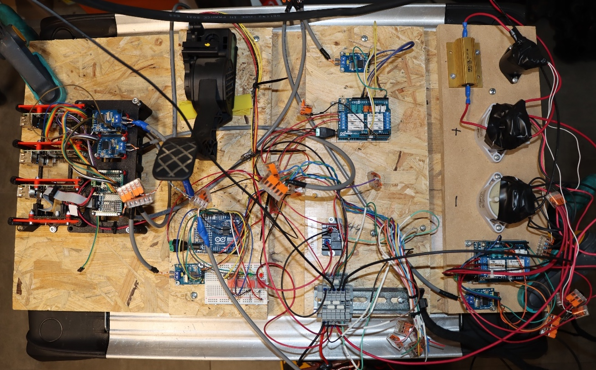
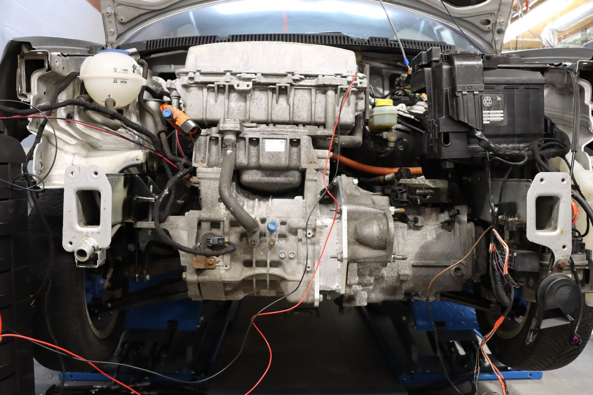
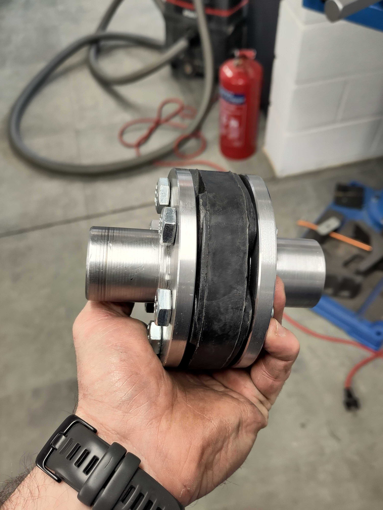
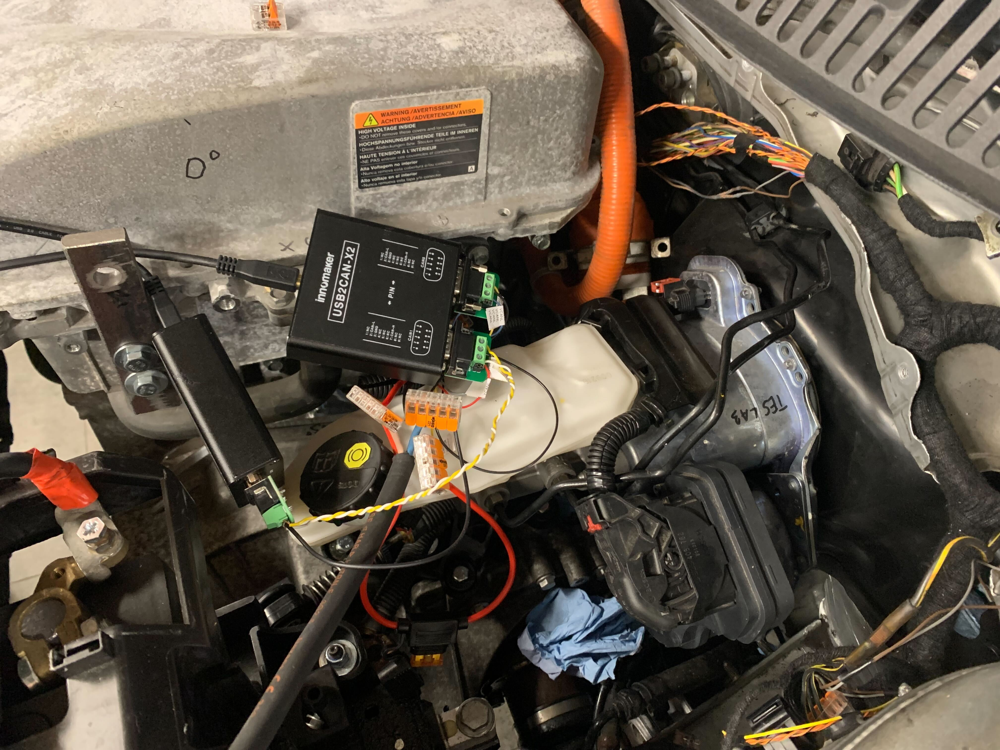
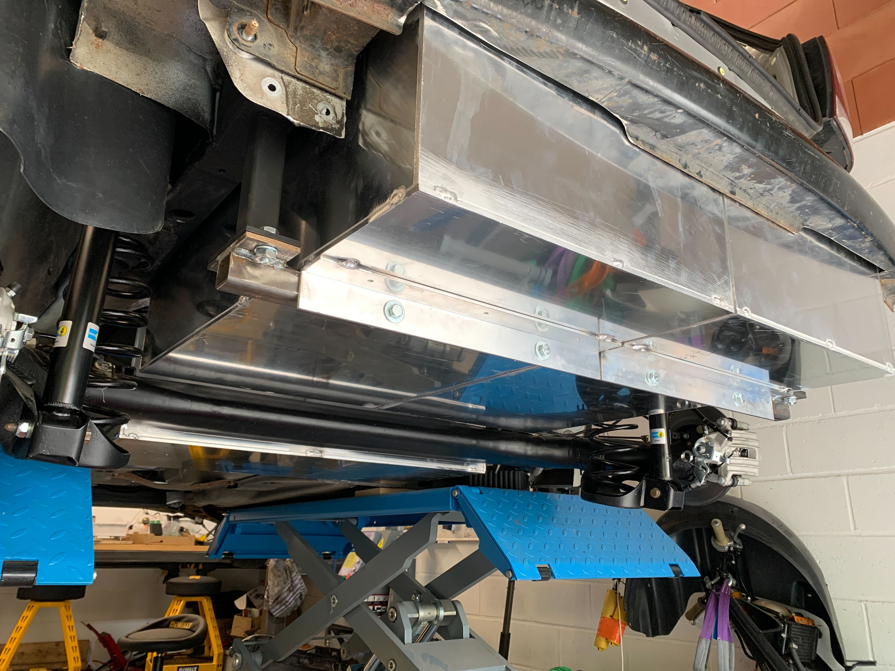
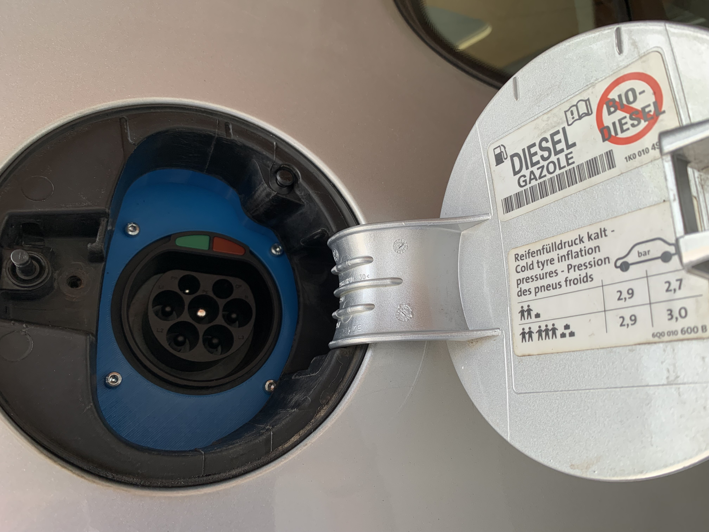

# Retrofitting a polo and controlling it with raspberry pis and arduinos

In the makerverse, we often meet people with ideas that could be qualified as "crazy"... Loïc, Thibault and Marc probably fit in this category of people that spend their free time on unusual projects.

They decided to challenge themselves by taking a 2007 VW Polo, sticking a 2013 Nissan Leaf motor in it, to use a Nissan nv200 battery with it as well as modify the Polo components to experiment with remote and self-driving...

## From a reflexion on vehicle durability to a concrete project

Vehicle retrofitting (converting a thermal vehicle to an EV), is considered today as one of the many possible solutions to reducing the carbon footprint of individual travel. It allows to capitalize on the vehicle's existing carbon footpring with the assumption that converting an existing vehicle to extend it's lifetime will overall emit less CO2 than disposing of the existing car and manufacturing a new one.

The term "retrofit" is also used in other context, including when "augmenting" existing vehicles with components that were not made for them, for instance enhancing existing construction or farming equipement with more modern capabilities such as autonomous driving, with or without changing it's power source. The term is also used in the manufacturing industry when enhancing existing heavy fixed or mobile machinery.

The question that Loïc, Thibault and Marc asked themselves is the following: "What is the actual cost of retrofitting a vehicle, either from a pure mecanical modifications, as well as technological, to bring it to the level of comfort that people expect nowadays?". With a follow-up question: "Is it really worth it?".

THe question of the business viability behind retrofitting vehicles is still relatively unanswered. Although popular today in some countries for old-timers conversion, the question remains open for relatively recent vehicles or heavier vehicles such as large trucks, construction vehicles, farming equipement or even boats...

Whatever you are retrofitting, the process stays relatively similar, but the space you'd need as well as the equipement might vary... For our small makers teams, it was easier to work on a small factor car rather than a semi truck...

## Technical choices

One of the obstacles you meet along the way when you change components in a car that was not initially made for them is to make them understand each other... Indeed, already in 2007, a lot of the car's features were communicating together through a communication bus that can also be found in more recent cars, the [CAN BUS](https://en.wikipedia.org/wiki/CAN_bus).

This is a communication bus mainly used in the automotive industry but also in most industrial machinery and aeronautics industry.

Let's take an example: putting a Nissan Leaf motor insite our Polo. The messages that the Polo exchanges on it's communication bus are different than those the Nissan Leaf motor expects and vice versa. It is therefore necessary to create a "translation" layer between the two that will make these two understand each other. Any component added to the car, that is not supported by default, needs to go through that translation layer.

That layer is what they have been using arduinos and raspberry pis for! In order to know which messages needed to be supported by their system, they have to reverse engineer them from the components they bought since the documentation is rarely available from the manufactuteurs.

They platform, OVCS (Open Vehicle Control System) is composed of multiple parts:

- The VMS (Vehicle Management System) is the central brains and deals with the translation and routing of the messages to the correct CAN network. All components from the car are connected to it, as well as specific controllers and the infotainment system.
- The controllers, which allow them to augment analog or digital functions of the car to connect them to the CAN bus or to enable the relays that will make it possible to power the electric motor.
- The infotainment, which is an optional module, adds a touchscreen to the car. The screen can be used to view useful information and will allow the driver to change parameters of the car or diagnose it in more details in the future.

They project combines multiple communication buses, aggregated by the VMS. Here's what the current architecture looks like.

The VMS is composed of:
- 3 raspberry PI 4 (to ensure redundency in the future)
- 1 homemade SPI "hub" that allows to connect until 12 CAN networks thanks to several MCP2518fd
- A custom PSU to power it all

The controllers are composed of:
- 1 arduino R4 Minima
- 1 SPI CAN module (mcp2518fd)

These are not automotive grade components. At the moment, they are focusing on prototyping everything with off the shelves components.

The firmware for the raspberry pis are developed thanks to [Nerves](https://nerves-project.org/) which allows them to use a higher level language based on Erlang called [Elixir](https://elixir-lang.org/).

Elixir is a language that is particularly adapted to real-time use cases and based on the "pattern matching" programming paradigm. It's ideal to process the messages than flow through the network. Their code is available on github: [OVCS](https://github.com/open-vehicle-control-system/ovcs).

Finally, in order to manage the battery, they went for a BMS (Battery Management System) from [Orion](https://www.orionbms.com/).

## Body and mechanical modifications

Communication issues between incompatible components put aside, there is still the problem of physically fitting pieces inside the car. Indded, the Nissan Leaf motor will not have the same anchors on the car chassis than the old diesel engine. And since they kept the original gearbox, the blueprint of the Nissan motor does not fit the one from the Polo gearbox. All these pieces need to be fabricated.

### Fixing the motor

Two pieces have been custom made and some welding was necessary in order to fix the Nissan motor in the Polo engine bay. New pieces were welded on the chassis for the motor to be fixed. Two connection pieces were fabricated for the connection with the gearbox. One to match both blueprints and stick the motor to the gearbox, and the other one to connect the gearbox axle with the motor axle. These were fabricated in their garage.

### Installing a new servo brake

Thermal cars usually use the depression created from the engine to provide brake assistance. Since the engine was replaced by an electric motor, the brake system needed to be reviewed.

It turns out EV use a specific type of brake booster that renders the old system obsolete. So they found a second hand Tesla Model 3 iBooster and put it in the car. They then proceeded to reverse engineer the can messages to be able to control braking from the CAN Bus.

### The battery

For the battery, more modifications were made to the Polo. Three aluminum containers were fabricated to hold the battery cells and some more body modifications were necessary to make them fit in the available space.
- The spare wheel container was cut off in order to leave space for two cells container under the car.
- The fuel tank was removed and replaced by another cells container.

### Additional changes

Besides these changes, both drivetrains were renovated and the car was equipped with brand new disc brakes as well as new suspensions.

## Ok but... does it drive?

The car has not yet left the garage but wheels are turning! The platform they developed gives the ability to test the communication between all retrofitted components and to use their throttle by wire solution using the old gas pedal to power the motor and give torque to the wheels.

More adaptations than the ones described above have been made in order to make this retrofit as smooth as possible:
- The original key lock is what powers the whole system, including the activation of the relays that power the Nissan motor
- The RPM gauge on the Polo dash shows correct RPMs from the Nissan motor, meaning these messages are translated
- The infotainment is showing different statuses from the car (handbrake status, doors status, ...)

Their project is currently reaching a functional prototype phase and at the moment of this writing, they are re-wiring the car to connect all components, including the battery, inside the car. Once this is done, they will drive the car out of the garage!

## Next steps

There is still some way to go in order to make this a self-driving car, and more specifically:
- Replace the existing steering column. Indeed, the original one from the Polo cannot be controlled over CAN. They can currently accelerate and brake via CAN but not Steer yet.
- Improve their software to make sure there is enough redundency and safety in the system.

## What they have to say about their project

> The most difficult part in a retrofit is the creation of the kit itself. This kit will be compatible with a very limited number of components and car models. If you compare this with all possible combinations of cars and components, you can quickly realize that scaling this kind of activity is not straightforward. From an environment perspective, retrofitting existing cars with EV capabilities is still the best way to capitalize on it's existing carbon footprint, but from an economical perspective, it's hard to think it's really worth it. For old timers that's a different story, because there is an emotional factor that transcends the retrofit price in itself. For larger and more expensive vehicles, this could make sense. A semi that has a 25 tons capacity can spare 3 tons for batteries. It's still left with 22 tons of useful load. But in the end, it will be a price/benefit discussion for the companies considering this move for their trucks or other heavy equipment.

> One way to reduce the price of creating retrofitting kits would be to have access to vehicle manufacturers specificitations, and more specifically, the "interface" with the components, the messages we need to send for it to operate. This could be done for any vehicle that is considered end-of-life for the manufacturers but some manufacturers platforms last sometimes decades so this is not easy as it sounds. Moreover, it's not really in their interest that this information be released to the public or to specific companies. However, one might ask a valid queston: when I'm buying a car, how much of it do I own? Shouldn't I be allowed to use any of it's pieces as I see fit? The current situation is contradictory to the notion of 'right to repair' that the EU is working on. We will see how the automotive industry evolves in the next years in light of this.

> Beyond the retrofit itself, this project is a huge learning opportunity for us. You can only work on this kind of projects if you have a pluridisciplinary team with some knowledge in mechanics, fabrication, software and hardware. We are lucky enough to have those skills with the three of us to work on this. Some pay, sometimes a lot of money, to go to trainings. We decided to just learn by doing... Every obstacle along the way, we discuss options, try different solutions and see what works best. To this day, we don't know yet what we'll do with this project, we're just enjoying the ride. It gives us a few ideas on what kind of professional activity we could develop later on though. We will reflect on this in a few months. All our work will be open sourced, documented and made public.
